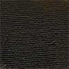

# Finding the Hex and RGB values for Williamsburg Oil Paints

**Table of contents:**
* [Introduction](#Introduction)
* [Process](#Process)
* [Color List](#Color-List)

## Introduction
The idea for this project came from a conversation I had with a designer who asked for my input on colors to use for a user interface. While I was able to help to an extent, as a painter, my mind works more in oil paint colors than it does in hex or RGB colors. 

Following our conversation, I decided to create a program that would gather all of the oil paint swatch images from the website of my favorite oil paint company, [Williamsburg Oils](https://www.williamsburgoils.com), and process each image, finding the cetroid hex and RGB values within the image using computer vision and KMeans clustering.

The end result is the table at the end of this README, where I've listed the hex color and corresponding RGB color next to the original image pulled from Williamsburg Oils' website. 

Please note that the resulting hex/RGB color resulting from the program is simply the median value derived from the KMeans clustering program with `n_clusters` set to `1`. Additionally, the resulting value is not going to be an exact match to the oil paint color due to the properties and qualities of oil paints, as well as the differences in how colors appear to the human eye in-person versus through a computer screen. 

## Process

### Collect information & images
To begin, I first scraped the name of the paint color, its alternate name and the link to the image of the paint swatch from the website using `Selenium`. From there, I used `urlretrieve` from `urllib` to save all of the image files from the website into the [images](./images/) directory in this repository for use during the next phase of the project.

### Computer vision & color identification
Once I collected all the images, I used `cv2` and `KMeans` to read in the image and find the centroid for the RGB values for each of the images. The function I created returned the hex color and the RGB values as a tuple, so I used the index values for the tuple to save the hex and RGB colors into separate columns in the dataframe.

A quick note on the function I created to find the centroids. While the function I created has the hyperparameter `number_of_colors` set to 10 as the default, I passed in 1 when I called the function, as I wanted to obtain the centroid for the image as a whole. 

### The resulting colors
While I had the hex and RGB values for each of the colors saved in the dataframe, I also wanted to create a file where I could see the color that corresponds to those values and compare it to the original image I pulled from Williamsburg Oils' website (see [color list](#Color-List) below to view the results). 

To do this, I created an array of arrays filled solely with the RGB colors identified as the centroid from the section before. From there, I changed some of the formatting parameters, and then used `plt.imshow()` to create an image of the figure that I then saved into the [returned_images](./returned_images/) directory in this repository.

## Color List

For the columns in the table below:
* **Color name:** The official name of the oil paint color as determined by Williamsburg Oils.
* **Hex color:** The hex color value that corresponds to the oil color as determined using computer vision and machine learning.
* **RGB color:** The RGB color values that corresponds to the oil color as determined using computer vision and machine learning.
* **Paint swatch:** The original image of the paint color as obtained from Williamsburg Oils' website and that was used to determine the hex and RGB colors.
* **Returned color:** The color that corresponds to the RGB color determined from the original paint swatch using computer vision and machine learning.

|Color name|Hex color|RGB color|Paint swatch|Returned color|
|-----|-----|-----|-----|-----|
|Alizarin Crimson|#542223|[84, 34, 35]|||
|Alizarin Orange|#b25417|[178, 84, 23]|||
|Alizarin Yellow|#956a22|[149, 106, 34]|||
|Bismuth Vanadate Yellow|#f4dd0c|[244, 221, 12]|||
|Bohemian Green Earth|#353821|[53, 56, 33]|||
|Brilliant Yellow Extra Pale|#f4f0d4|[244, 240, 212]|||
|Brilliant Yellow Pale|#f4eca0|[244, 236, 160]|||
|Brown Ochre|#5e4821|[94, 72, 33]|||
|Brown Pink|#272320|[39, 35, 32]|||
|Brown Umber|#282520|[40, 37, 32]|||
|Burnt Sienna|#583122|[88, 49, 34]|||
|Burnt Umber|#27261f|[39, 38, 31]|||
|Cadmium Green|#3b6925|[59, 105, 37]|||
|Cadmium Green Light|#6c9636|[108, 150, 54]|||
|Cadmium Lemon|#ebde33|[235, 222, 51]|||
|Cadmium Orange|#ee7e19|[238, 126, 25]|||
|Cadmium Purple|#583233|[88, 50, 51]|||
|Cadmium Red Deep|#8b2f22|[139, 47, 34]|||
|Cadmium Red Light|#e05319|[224, 83, 25]|||
|Cadmium Red Medium|#af3923|[175, 57, 35]|||
|Cadmium Red Purple|#6d2a20|[109, 42, 32]|||
|Cadmium Red Vermillion|#d74b1f|[215, 75, 31]|||
|Cadmium Yellow Deep|#eeb913|[238, 185, 19]|||
|Cadmium Yellow Extra Deep|#f6940c|[246, 148, 12]|||
|Cadmium Yellow Light|#f0de28|[240, 222, 40]|||
|Cadmium Yellow Medium|#f1d220|[241, 210, 32]|||
|Canton Rose|#c97e5f|[201, 126, 95]|||
|Carl's Crimson (Permanent)|#642622|[100, 38, 34]|_swatch.jpg)|_returned.jpg)|
|Cerulean Blue (Genuine)|#1a4384|[26, 67, 132]|_swatch.jpg)|_returned.jpg)|
|Cerulean Blue French|#132f70|[19, 47, 112]|||
|Chromium Oxide Green|#517339|[81, 115, 57]|||
|Cinnabar Green Light|#b6b432|[182, 180, 50]|||
|Cobalt Blue|#16297e|[22, 41, 126]|||
|Cobalt Blue Deep|#1b2a81|[27, 42, 129]|||
|Cobalt Green|#2f6531|[47, 101, 49]|||
|Cobalt Teal Bluish|#13a695|[19, 166, 149]|||
|Cobalt Teal Greenish|#4da695|[77, 166, 149]|||
|Cobalt Turqoise Bluish|#203c70|[32, 60, 112]|||
|Cobalt Turqoise Greenish|#2a5a71|[42, 90, 113]|||
|Cobalt Violet Deep|#2f1e51|[47, 30, 81]|||
|Cobalt Violet Light|#722153|[114, 33, 83]|||
|Cobalt Yellow|#d8b223|[216, 178, 35]|||
|Cold Black|#182023|[24, 32, 35]|||
|Courbet Green|#1a2923|[26, 41, 35]|||
|Cyprus Orange|#955b26|[149, 91, 38]|||
|Davy's Grey Deep|#222725|[34, 39, 37]|||
|Dianthus Pink|#e9a2ad|[233, 162, 173]|||
|Dutch Brown (Transparent)|#1e1e1e|[30, 30, 30]|_swatch.jpg)|_returned.jpg)|
|Earth Green|#323b1d|[50, 59, 29]|||
|Egyptian Violet|#1b1a2d|[27, 26, 45]|||
|Fanchon Red|#c23a21|[194, 58, 33]|||
|Flake White|#f7f3d6|[247, 243, 214]|||
|French Ardoise Gray|#8a806b|[138, 128, 107]|||
|French Brown Ochre|#4b3b2a|[75, 59, 42]|||
|French Burnt Ochre|#3e3024|[62, 48, 36]|||
|French Burnt Umber|#312f29|[49, 47, 41]|||
|French Light Sienna|#6a5b35|[106, 91, 53]|||
|French Ochre Havane|#9e6739|[158, 103, 57]|||
|French Raw Sienna|#896332|[137, 99, 50]|||
|French Raw Umber|#48422f|[72, 66, 47]|||
|French Rouge Indian|#733f2f|[115, 63, 47]|||
|French Terre Verte|#517665|[81, 118, 101]|||
|French Yellow Ochre Deep|#9e6e2d|[158, 110, 45]|||
|German Earth|#171c1b|[23, 28, 27]|||
|Graphite Gray|#30322e|[48, 50, 46]|||
|Green Gold|#23310e|[35, 49, 14]|||
|Indanthrone Blue|#0b1246|[11, 18, 70]|||
|Indian Yellow|#e1900a|[225, 144, 10]|||
|Indigo|#18272d|[24, 39, 45]|||
|Interference Blue|#b8c0c9|[184, 192, 201]|||
|Interference Green|#dddbb5|[221, 219, 181]|||
|Interference Red|#d8ba9e|[216, 186, 158]|||
|Interference Violet|#c9b5b9|[201, 181, 185]|||
|Iridescent Bronze|#786644|[120, 102, 68]|||
|Iridescent Copper|#914b31|[145, 75, 49]|||
|Iridescent Pale Gold|#eac66e|[234, 198, 110]|||
|Iridescent Pearl White|#e4ddc9|[228, 221, 201]|||
|Iridescent Pewter|#666565|[102, 101, 101]|||
|Iridescent Silver|#7c7977|[124, 121, 119]|||
|Italian Black Roman Earth|#1f2322|[31, 35, 34]|||
|Italian Burnt Sienna|#63341c|[99, 52, 28]|||
|Italian Green Ochre|#73582b|[115, 88, 43]|||
|Italian Lemon Ochre|#c29527|[194, 149, 39]|||
|Italian Orange Ochre|#8f5220|[143, 82, 32]|||
|Italian Pink|#302520|[48, 37, 32]|||
|Italian Pompeii Red|#9c4a2b|[156, 74, 43]|||
|Italian Pozzuoli Earth|#884123|[136, 65, 35]|||
|Italian Raw Sienna|#7d5624|[125, 86, 36]|||
|Italian Raw Umber|#3a3829|[58, 56, 41]|||
|Italian Rosso Veneto|#854a2a|[133, 74, 42]|||
|Italian Terra Rosa|#883f24|[136, 63, 36]|||
|Italian Terra Verte|#4d6c47|[77, 108, 71]|||
|Italian Yellow Ochre|#ab8129|[171, 129, 41]|||
|Ivory Black|#191e20|[25, 30, 32]|||
|Jaune Brilliant|#ecbd6a|[236, 189, 106]|||
|King's Blue|#5d9acf|[93, 154, 207]|||
|Lamp Black|#1b2122|[27, 33, 34]|||
|Manganese Violet|#322246|[50, 34, 70]|||
|Mars Black|#141d1f|[20, 29, 31]|||
|Mars Orange|#7e4227|[126, 66, 39]|||
|Mars Red|#5f281d|[95, 40, 29]|||
|Mars Red Light|#763926|[118, 57, 38]|||
|Mars Violet|#4d241e|[77, 36, 30]|||
|Mars Yellow Deep|#9f7127|[159, 113, 39]|||
|Mars Yellow Light|#a07a3a|[160, 122, 58]|||
|Montserrat Orange|#d98e55|[217, 142, 85]|||
|Naples Yellow|#cfb151|[207, 177, 81]|||
|Naples Yellow Italian|#e9c054|[233, 192, 84]|||
|Naples Yellow Reddish|#dd9951|[221, 153, 81]|||
|Nickel Azo Yellow|#2d241a|[45, 36, 26]|||
|Nickel Yellow|#e7dd69|[231, 221, 105]|||
|Olive Green|#4f671b|[79, 103, 27]|||
|Payne's Gray|#171f27|[23, 31, 39]|||
|Payne's Gray (Violet)|#1d2126|[29, 33, 38]|_swatch.jpg)|_returned.jpg)|
|Permanent Crimson|#581f1a|[88, 31, 26]|||
|Permanent Green|#17612d|[23, 97, 45]|||
|Permanent Green Light|#57b352|[87, 179, 82]|||
|Permanent Lemon|#ece12f|[236, 225, 47]|||
|Permanent Orange|#f76524|[247, 101, 36]|||
|Permanent Red-Orange|#c6491c|[198, 73, 28]|||
|Permanent Yellow Deep|#f3ab13|[243, 171, 19]|||
|Permanent Yellow Light|#ede133|[237, 225, 51]|||
|Permanent Yellow Medium|#eed129|[238, 209, 41]|||
|Persian Rose|#dd4947|[221, 73, 71]|||
|Perylene Crimson|#471d1d|[71, 29, 29]|||
|Phthalo Blue|#162857|[22, 40, 87]|||
|Phthalo Green|#122633|[18, 38, 51]|||
|Phthalo Green-Yellowish|#14282c|[20, 40, 44]|||
|Phthalo Turquoise|#112834|[17, 40, 52]|||
|Provence Violet Bluish|#332674|[51, 38, 116]|||
|Provence Violet Reddish|#662851|[102, 40, 81]|||
|Prussian Blue|#0e1b26|[14, 27, 38]|||
|Pyrrole Orange|#f75903|[247, 89, 3]|||
|Pyrrole Red|#b71a15|[183, 26, 21]|||
|Quinacridone Gold Brown|#411c1a|[65, 28, 26]|||
|Quinacridone Magenta|#542223|[84, 34, 35]|||
|Quinacridone Red|#a12e24|[161, 46, 36]|||
|Quinacridone Violet|#4c2029|[76, 32, 41]|||
|Raw Sienna|#895f25|[137, 95, 37]|||
|Raw Umber|#1f231d|[31, 35, 29]|||
|Red Ochre|#6c3b27|[108, 59, 39]|||
|Red Umber|#322923|[50, 41, 35]|||
|SF Cerulean Blue French|#273570|[39, 53, 112]|||
|SF Cobalt Violet Light|#893298|[137, 50, 152]|||
|SF Flake White|#deddde|[222, 221, 222]|||
|SF French Ardoise Grey|#8d867a|[141, 134, 122]|||
|SF Italian Terra Verte|#3c5444|[60, 84, 68]|||
|SF Porcelain White|#d4d2d8|[212, 210, 216]|||
|SF Titanium White|#dcdbe1|[220, 219, 225]|||
|SF Ultramarine Blue|#1f235a|[31, 35, 90]|||
|SF Ultramarine Blue French|#25285a|[37, 40, 90]|||
|SF Ultramarine Pink|#663853|[102, 56, 83]|||
|SF Ultramarine Violet|#2a2a4e|[42, 42, 78]|||
|Sap Green|#273b29|[39, 59, 41]|||
|Sevres Blue|#1f6bb7|[31, 107, 183]|||
|Spanish Earth|#4c2f27|[76, 47, 39]|||
|Stil De Grain|#3a2f24|[58, 47, 36]|||
|Titan Buff|#e7d8ca|[231, 216, 202]|||
|Titanium - Zinc White|#f7f4df|[247, 244, 223]|||
|Titanium White|#f5f2e1|[245, 242, 225]|||
|Transparent Red Iron Oxide|#261921|[38, 25, 33]|||
|Transparent Yellow Iron Oxide|#371b1c|[55, 27, 28]|||
|Turkey Umber|#1f2824|[31, 40, 36]|||
|Turquoise|#1a6b70|[26, 107, 112]|||
|Ultramarine Blue|#162040|[22, 32, 64]|||
|Ultramarine Blue French|#182247|[24, 34, 71]|||
|Ultramarine Pink|#371d2c|[55, 29, 44]|||
|Ultramarine Violet|#202141|[32, 33, 65]|||
|Unbleached Titanium|#cdb792|[205, 183, 146]|||
|Unbleached Titanium Pale|#dbc9aa|[219, 201, 170]|||
|Van Dyke Brown|#2d3630|[45, 54, 48]|||
|Veronese Green|#23846a|[35, 132, 106]|||
|Viridian|#1a3237|[26, 50, 55]|||
|Yellow Ochre (Domestic)|#ae802b|[174, 128, 43]|_swatch.jpg)|_returned.jpg)|
|Yellow Ochre Burnt|#5c4322|[92, 67, 34]|||
|Zinc White|#f6f4d9|[246, 244, 217]|||